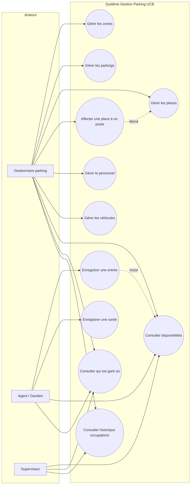
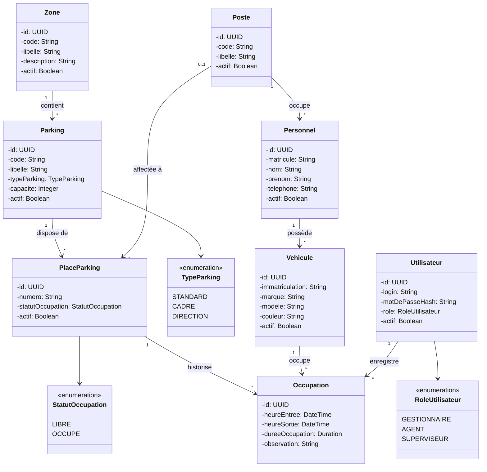
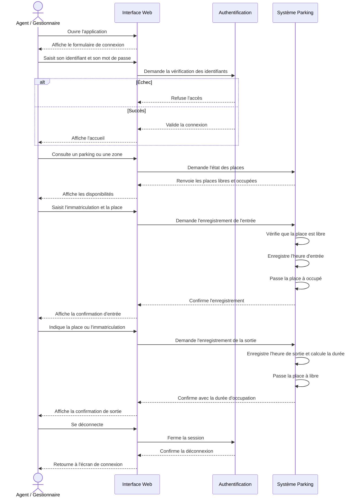
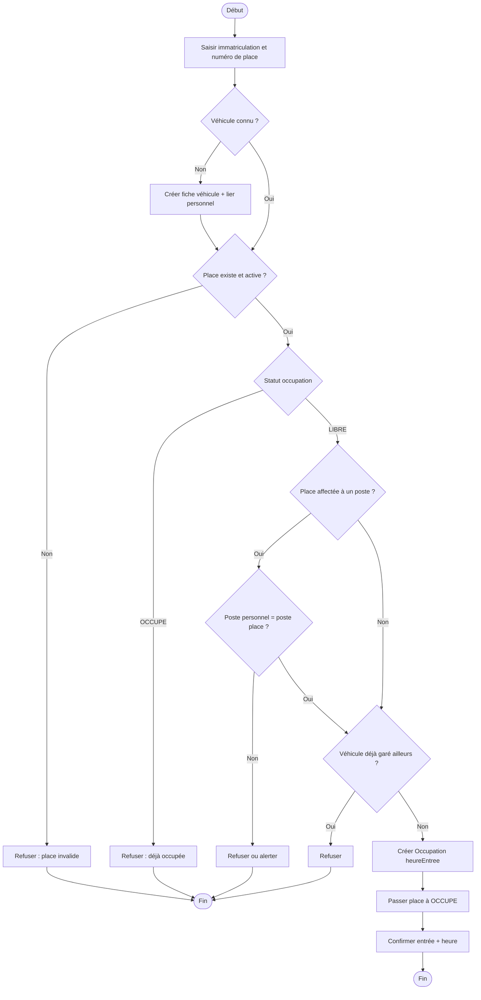
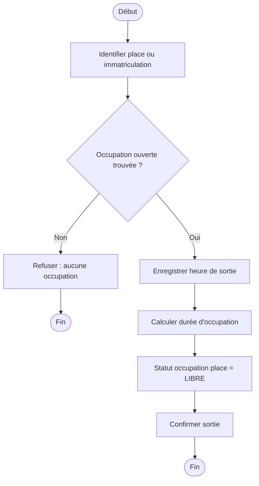
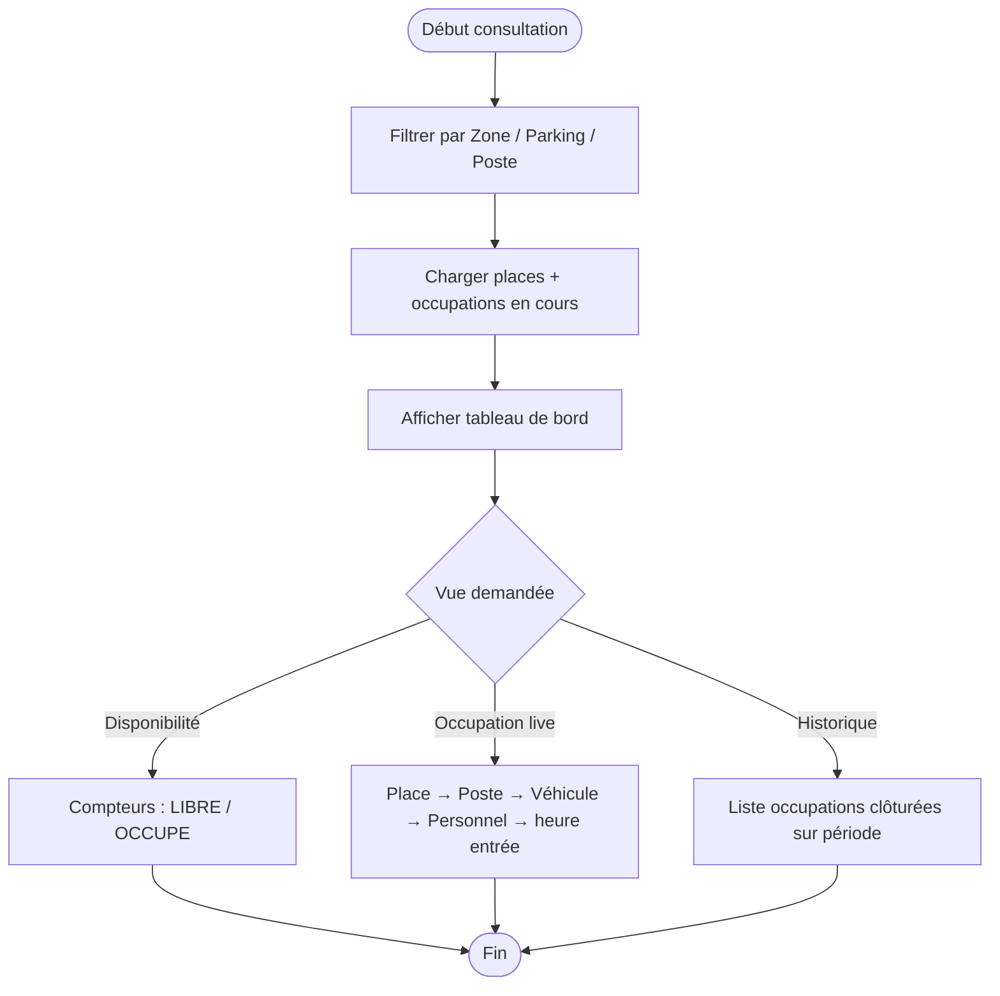

# Diagrammes UML — Gestion des occupations de parking UCB

> Mini-projet : suivi de la **disponibilité** et de l’**occupation** des places de parking (entrée / sortie), zones, places **affectées à un poste** (DG, DGA, DRH…) et parking cadres.

---

## 1. Diagramme de cas d'utilisation

### Acteurs

| Acteur | Rôle |
|--------|------|
| **Gestionnaire parking** | Paramètre zones, parkings, places, postes, personnel et véhicules |
| **Agent / Gardien** | Enregistre les entrées et sorties sur le terrain |
| **Superviseur** | Consulte disponibilités, occupations en cours et historiques |

### Cas d'utilisation principaux

| CU | Description |
|----|-------------|
| Gérer zones / parkings / places | CRUD du référentiel spatial |
| Affecter une place à un poste | Lier une place à un poste (DG, DGA, DRH…) — pas de réservation |
| Gérer personnel / véhicules | Fiches employés (avec poste) et véhicules associés |
| Enregistrer entrée | Véhicule + place → statut **OCCUPE**, heure d'entrée |
| Enregistrer sortie | Clôturer l'occupation → statut **LIBRE**, heure de sortie |
| Consulter disponibilités | Places libres / occupées par parking ou zone |
| Consulter qui est garé où | Véhicule, propriétaire, place, depuis quelle heure |
| Consulter historique | Occupations passées (entrée / sortie) |

---

## 2. Diagramme de classes

### Exemples de postes

| Code | Libellé |
|------|---------|
| DG | Directeur Général |
| DGA | Directeur Général Adjoint |
| DRH | Directeur des Ressources Humaines |
| … | Autres postes selon organigramme |

### Règles métier clés

1. Une **Zone** regroupe plusieurs **Parkings**.
2. Un **Parking** a un type : `STANDARD`, `CADRE` ou `DIRECTION`.
3. Le **statut d'occupation** d'une place est uniquement : `LIBRE` ou `OCCUPE`.
4. Une place **peut être affectée à un Poste** (DG, DGA, DRH…) — pas de mécanisme de réservation.
5. Un **Personnel** est rattaché à un **Poste** ; un **Véhicule** appartient à un Personnel.
6. Une **Occupation** lie Véhicule + Place + Agent : `heureEntree` à l'entrée, `heureSortie` à la sortie (`null` tant que le véhicule est garé).
7. À tout moment : **au plus une occupation ouverte** (`heureSortie` nulle) par place et par véhicule.
8. Contrôle optionnel à l'entrée : si la place a un poste, le personnel du véhicule devrait avoir le même poste.

---

## 3. Diagramme de séquence

Scénario complet : connexion → consultation → entrée → sortie.

---

## 4. Diagrammes d'activité

### 4.1 Processus d'entrée véhicule

### 4.2 Processus de sortie véhicule

### 4.3 Suivi de disponibilité d'une place

---

## 5. Synthèse du modèle de données (aperçu)

| Entité | Rôle |
|--------|------|
| `Zone` | Localisation géographique des parkings |
| `Parking` | Aire de stationnement (cadre, direction, standard) |
| `PlaceParking` | Emplacement unitaire ; éventuellement **affectée à un Poste** |
| `Poste` | Poste organisationnel (DG, DGA, DRH…) — pas de réservation |
| `Personnel` | Employé rattaché à un poste, propriétaire du véhicule |
| `Vehicule` | Immatriculation liée au personnel |
| `Occupation` | Mouvement entrée/sortie = cœur du suivi |
| `Utilisateur` | Agent / Gestionnaire / Superviseur |
